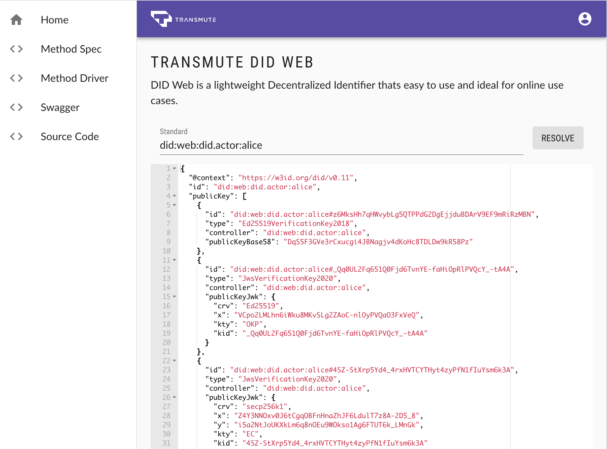

# Transmute DID Web 

> Decentralized identifiers (DIDs) are a new type of identifier to provide verifiable, decentralized digital identity. These new identifiers are designed to enable the controller of a DID to prove control over it and to be implemented independently of any centralized registry, identity provider, or certificate authority. DIDs are URLs that relate a DID subject to a DID document allowing trustable interactions with that subject. DID documents are simple documents describing how to use that specific DID. Each DID document can express cryptographic material, verification methods, or service endpoints, which provide a set of mechanisms enabling a DID controller to prove control of the DID. Service endpoints enable trusted interactions with the DID subject.

<!-- [](https://did-web.web.app) -->

## [DID Web Spec](https://w3c-ccg.github.io/did-method-web/)

### Web App

https://did-web.web.app/

### API

https://did-web.web.app/api/docs

```
npm i
npm run build
npm run deploy
```
